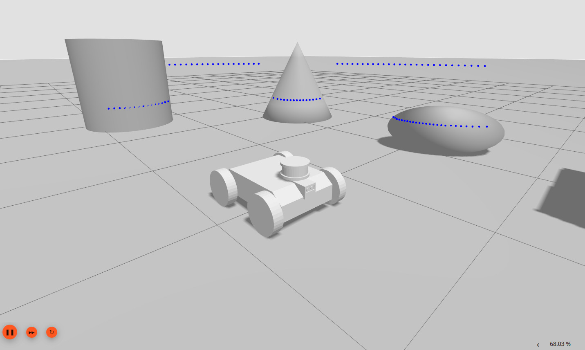
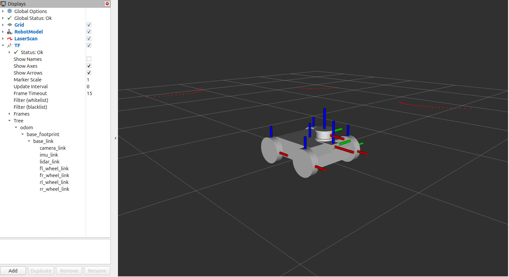

# Simple Differential Drive Robot Simulation

A simple differential drive robot simulation developed using ROS 2 and Gazebo.

## Overview

This project contains a minimal differential drive robot model created for learning and experimenting with mobile robotics concepts.

The robot is intentionally kept simple so that the focus remains on the underlying ROS 2 concepts, simulation, sensors, and robot control.

The project can later be extended with mapping, navigation, and autonomous driving capabilities.

## Features

- Differential drive robot
- ROS 2 integration
- Gazebo simulation
- Wheel joint control
- TF frames
- Odometry
- LiDAR sensor
- IMU sensor
- RViz visualization
- Velocity command control

## Project Structure

```text
rover_description/
├── config/
├── launch/
├── meshes/
├── urdf/
├── worlds/
├── CMakeLists.txt
├── package.xml
└── .gitignore
```

## Requirements
- Ubuntu 24.04
- ROS 2 Jazzy
- Gazebo Harmonic

## Installation
Create a ROS 2 workspace:
```bash
mkdir -p ~/rover_ws/src
cd ~/rover_ws/src
```

Clone the repository:
```bash
git clone https://github.com/Nadayugendar07/differential-drive-robot-ros2.git
```

Build the workspace:
```bash
cd ~/rover_ws
source /opt/ros/jazzy/setup.bash
colcon build
```

Source the workspace:
```bash
source install/setup.bash
```

## Running the Simulation
Launch the Gazebo simulation:
```bash
ros2 launch rover_description gazebo.launch.py
```

RViz can be used to visualize the robot model, TF frames, and sensor data.

## Simulation
The project uses Gazebo for robot simulation and RViz for ROS 2 visualization and debugging.

The robot provides a basic platform for experimenting with:

- Sensor integration
- Robot localization
- Mapping
- Navigation
- Autonomous driving

## Screenshots

### Gazebo Simulation



### RViz Visualization



## Future Work
Possible future extensions include:

- SLAM
- Nav2 navigation
- Additional sensors
- Autonomous exploration
- Path planning
- Obstacle avoidance

## Author
Nadayugendar

GitHub: [Nadayugendar07](https://github.com/Nadayugendar07)
